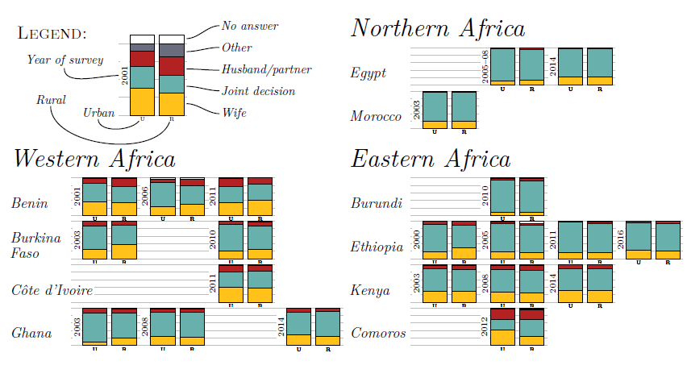
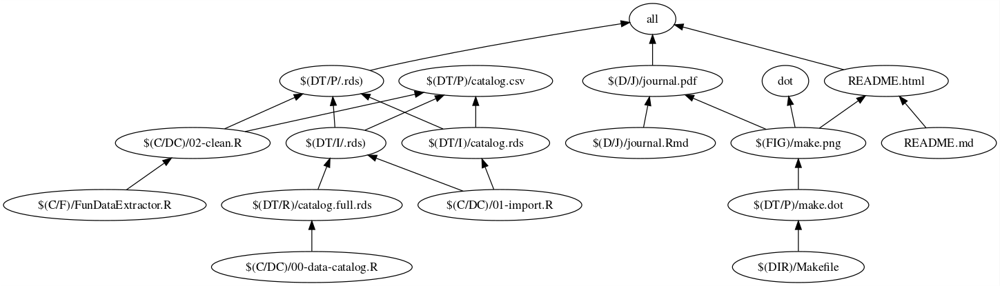

### Populaiton Horizons Factsheet Vol 14 Issues 1
# Contraceptive Decision-Making in Developing Countries

*Repository for analysis and design of the factsheet---and any interactive visualisations that may follow--- for the 14(1) issue of Population Horizons.*

The [Demographic and Health Survey (DHS) Programme](https://dhsprogram.com/Data/) has been conducting surveys to monitor indicators in the areas of population, health, and nutrition in over 90 countries for over thirty years. Since \emph{Wave 4} they have been asking the following question of women who are married or cohabiting:

>*``Would you say that using contraception is mainly your decision, mainly your husband's/partner's decision, or did you both decide together?''*

This analysis brings together the answers of over 800,000 women from a total of 144 surveys conducted in 67 countries---in some only once, in others up to four times over four waves from 1998 to 2016. The factsheet provides a convenient visualisation of the patterns, geographical and temporal as can be seen from this extract here.

#### Relevant links

* The factsheet/poster itself--[PH14.01.Factsheet.pdf](docs/presentations/PH14.01.Factsheet.pdf)
* The data table clean and extracted (144 rows, one for each country/survey combination and the weighted counts of each group)--[final.data.csv](data/processed/final.data.csv)
* The detailed methodology report--[methods.pdf](docs/reports/methods.pdf)

## Methods summary

*[This is a brief outline of the methodology, for more detail see the [methods.pdf](docs/reports/methods.pdf)` report]*

#### Data

The starting point for this analysis was 321 *Individual recode* files. The question comes from the individual questionnaires, and started being asked from phase IV onwards, although not always. Removing the files which did not have the question `v632`, or where all the answers were NA leaves us with 144 files. 

This is 144 surveys conducted in 67 countries over the period 1998-2016. 

For each of the surveys only four variabels are extracted 
(see [recode questionnaires](https://dhsprogram.com/publications/publication-dhsg4-dhs-questionnaires-and-manuals.cfm) for details):

* `v000`-- the wave code (this turns out to be a bad idea, since waves don't correspond to phases, go figure)
* `v005`-- the sample weights for individuals
* `v102`-- de facto type of place of residence (rural/urban)
* `v632`-- *the* question: who decides on contraception.

 

Out of each dataset the weighted counts are calculated for the crosstabulation of `v102` and `v632`. The possible answers for `v632` are:

* 1--wife
* 2--husband
* 3--both
* 6--other
* 9--missing

However the last two options are not present in all surveys, so the crosstabulationns are sized 2x3, 2x4 or 2x5, depending on the possible answers. (missing are explicitly listed in a few surveys, but not in most of them, where they are just NAs, which would have to be manually separated from the 'not married and/or not using contraception` NAs..

_**Denominator:**_ The question is only asked of women currently married or cohabiting, who are currently using contraception.  

The questions can be found here:

* [DHS IV Model Questionnaire p. 89](https://dhsprogram.com/pubs/pdf/DHSQ4/DHS-IV-Model-A.pdf.pdf)
* [DHS V Model Questionnaire p.W49](https://dhsprogram.com/pubs/pdf/DHSQ5/DHS5-Woman's-QRE-22-Aug-2008.pdf)
* [DHS VI Model Questionnaire p.W.46](https://dhsprogram.com/pubs/pdf/DHSQ6/DHS6_Questionnaires_5Nov2012_DHSQ6.pdf)
* [DHS VII Model Questionnaire p.W.62](https://dhsprogram.com/pubs/pdf/DHSQ7/DHS7-Womans-QRE-EN-07Jun2017-DHSQ7.pdf)

These counts are weighted using the women's sample weights ([see here](https://dhsprogram.com/data/Using-DataSets-for-Analysis.cfm#CP_JUMP_14042)), then the column-wise percentages are calculated to get the distribution within each type of residence (urban and rural), with 100% being the number of valid answers. 

#### Reproducibility

The whole process from downloading the data, extracting the files, cleaning and processing the data, saving outputs, plotting the charts and laying out the final poster/factsheet is fully documented and automated, and made publicly available in this repository. 

The repository contains all the code and instructions to recreate the whole process, short of the actual data themselves, which are available throug a free  (for non-commnercial purposes) registration with DHS. Even so, the summary tables that are required to produce the charts are made available here as well: [final.data.csv](data/processed/final.data.csv).

## Technical summary

#### Makefile

The makefile is visualised below---be warned, this is the current state of the project, which is still in progress. 

### Prerequisites

DHS data requires free (for non-commnercial purposes) registration. With the help of the [`lodown `](https://github.com/ajdamico/lodown) package all the data download and extraction is automated.

R, Rstudio (pandoc, make), Python, some sort of unzipping utility... If it works, don't break it.

### Authors

* **Maja Zalo&zcaron;nik**

## License

This project is licensed under the ?

## Acknowledgments

@ajdamico 
