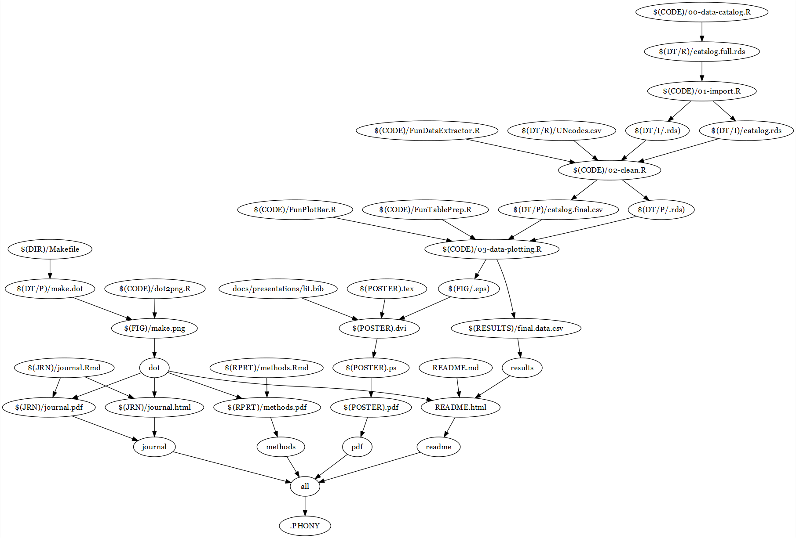

# Populaiton Horizons Factsheet Vol 14 Issues 1
## Global comparison on contraception decision-makeing in married unions based on DHS data

Repository for analysis and design of the factsheet---and any interactive visualisations that may follow--- for the 14(1) issue of Population Horizons.

## Makefile

Notes for deployment: should be able to run the whole thing with using the makefile. 

The makefile is visualised below---be warned, this is the current state of the project, which is still in progress. 

### Prerequisites

R, Rstudio (pandoc, make), Python, some sort of unzipping utility... If it works, don't break it.

### Authors

* **Maja Zalo\v znik**

## License

This project is licensed under the ?

## Acknowledgments

TBC
